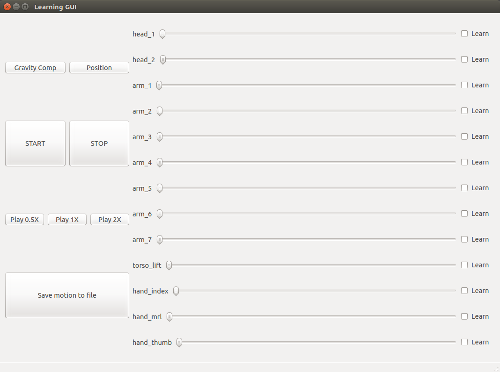

# Learning by demonstration GUI for TIAGo

GUI that enables the user to do learning by demonstration.

Presents sliders to be able to move the different joints of the robot.

Clicking on the checkbox you activate the learning from that joint.

You can change the arm control mode to gravity compensation if wanted to move the arm 1-4 joints by hand.

Once START button is pressed every joint checked will be recorded up until the STOP button is pressed.

Then the user can play what was learnt (at 0.5x, 1x and 2x speed).

You can finally save the motion to a file if wanted pressing the corresponding button.

