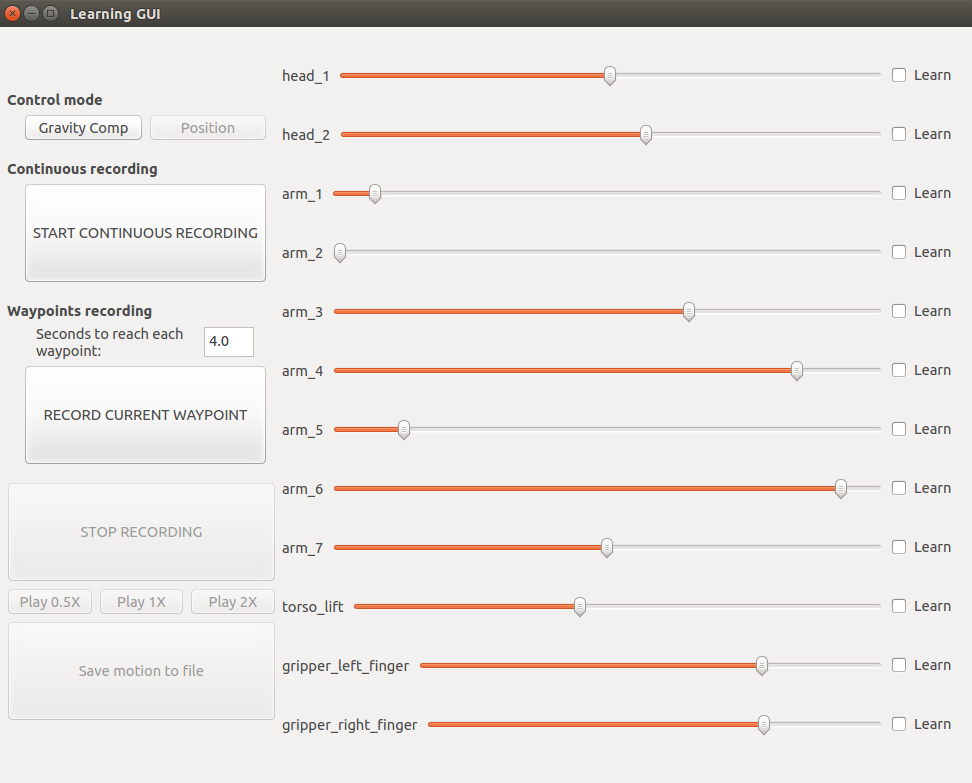
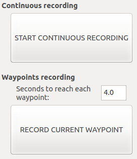
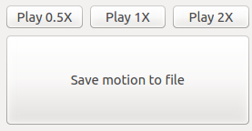

# Learning by demonstration GUI for TIAGo

GUI that enables the user to create a new upper body motion by using learning by demonstration with TIAGo that can be then played back with the ROS [play_motion](http://wiki.ros.org/play_motion) package.

## Requirements
Some parts of the learning-by-demonstration software can only be run with a real TIAGo robot. This documentation describes the procedure to use this software with a real robot. Note that a computer installed with the TIAGo official development ISO is required.

In case of testing this software in the **simulation of TIAGo** please refer to the on-line tutorial in 

## How to run it
In order to run the learning-by-demonstration software with a real TIAGo follow the next steps. 

### Installation
Create, populate and build the required catkin workspace as follows:
```sh
$ mkdir -p ~/learning_ws/src
$ cd ~/learning_ws/src
$ git clone https://github.com/pal-robotics/simple_learning.git
$ git clone https://github.com/pal-robotics/learning_gui
$ cd ..
$ catkin build
```
### Deployment and execution in the robot

The *simple_learning* package needs to be deployed in the robot as follows:

```sh
$ cd ~/learning_ws
$ rosrun pal_deploy deploy.py --user pal --package simple_learning tiago-Xc
```
where the **X** in **tiago-Xc** is the serial number of the robot without leading 0s.
Once the package is deployed in the robot run it as follows:
```sh
$ ssh pal@tiago-Xc
$ roslaunch simple_learning simple_learning_server.launch
```
### Execution of the GUI
Open another terminal in the development computer and run the following instructions:
```sh
$ cd ~/learning_ws
$ source ./devel/setup.bash
$ export ROS_MASTER_URI=http://tiago-Xc:11311
$ roslaunch learning_gui learning_gui.launch
```
and the following GUI will show up:


## Gravity compensation of the whole arm
For the new wrist of TIAGo robot it's possible to enable the gravity_compensation_controller in the whole arm.

First the [gravity_compensation_controller_tutorial](https://github.com/pal-robotics/gravity_compensation_controller_tutorial) needs to be deployed on the robot. This implementation of the gravity_compensation_controller starts the joints of the wrist with no control to read the actual values of the encoders.

Once deployed it needs to be loaded as follows:
```
$ roslaunch gravity_compensation_controller_tutorial gravity_compensation_controller_tutorial.launch spawn:=false controller_ns:=gravity_compensation
``` 

Then, launch the learning_gui launch file with the specific argument to record the joints of the wrist when the robot is in gravity.

```sh
$ cd ~/learning_ws
$ source ./devel/setup.bash
$ export ROS_MASTER_URI=http://tiago-Xc:11311
$ roslaunch learning_gui learning_gui.launch wrist_in_position:=false
```

#### Select joints

First of all select the joints that you want to include in the new motion. Click on the corresponding checkboxes at the right part of the GUI. Note that the joints are grouped in the following groups:
* Head 
* Arm
* Torso
* End-effector

Then, if one of the joints of a group is selected, the reamining joints of that group are automatically selected too.

#### Recording a motion

There are two ways of recording the new motion:
* Continuous recording
* Waypoint recording



In the _Continuous recording_ mode the **/joint_states** topic is stored continuously while in the _waypoint recording_ mode the user specifies at what instants of time the values in the **/joint_states** topic are recorded. 

The **continuous recording mode** leads to a motion which will be very similar to the one taught by the user as many samples of the kinematic configuration will be recorded and the resulting speed of execution will be the same. The drawback of this mode is that any pause made by the user during the motion creation will be also recorded.

On the other hand, with the ***waypoint recording*** mode the user will need to specify how much time the robot will have for going from one sample point to another via interpolation, so that the resulting motion speed will depend on this parameter and on how far away are each consecutive sampling points. The main advantage of this mode is that delays made by the user during the motion definition are not recorded.

##### Continuous recording mode
First press the ***START CONTINUOUS RECORDING*** button. Note that this action will disable the _waypoint recording_ mode as they cannot be mixed. 
The user can then start moving the upper body of the robot to teach the new motion in two ways:
* **Moving individual joints using the sliders in the GUI**: all the joints of the upper body can be moved. It requires that the **control mode** is set to **Position**.
* Moving the arm by **kinesthetic teaching**: the joints of the arm can be physically maneuvered by the user when selecting the **Gravity Compensation** control mode. If the gravity_compensation controller installed on the robot uses the seven joints it will learn all the joints. Otherwise it will learn the first four joints. The remaining arm and upper body joints can be still moved using the sliders provided in the GUI.

In order to stop recording the motion press the ***STOP RECORDING*** button. 

##### Waypoints recording

First of all edit the _Seconds to reach each waypoint_ value so depending on how far apart will be the waypoints you are going the record and the desired speed of the resulting interpolated motion.

Move the upper body to the first desired kinematic configuration by using the sliders and/or the kinesthetic teaching described before. Then press the ***RECORD CURRENT WAYPOINT*** in order to define the first position of the motion. Keep changing the kinematic configuration of the robot and recording waypoints as needed and finally press the ***STOP RECORDING*** button.

#### Playing back the recorded motion

Note that after pressing the ***STOP RECORDING*** button the following part of the GUI which was disabled will be ready to be used:



There are three different buttons to play back the recorded motion:
* Play 0.5X: plays back the motion at half the speed
* Play 1X: plays back the original recorded motion
* Play 2X: plays back the recorded motion at double speed

#### Exporting the recorded motion

The ***Save motion to file*** button allows the user to store the original motion to a yaml file which looks like as follows:

```sh
play_motion:
  motions:
    LBD_1X:
      joints: [arm_1_joint, arm_2_joint, arm_3_joint, arm_4_joint, arm_5_joint, arm_6_joint,
        arm_7_joint, torso_lift_joint, gripper_left_finger_joint, gripper_right_finger_joint]
      meta: {description: LBD_1X, name: LBD_1X, usage: demo}
      points:
      - positions: [1.6101164490941724, -0.9301305388945986, -3.140345763855865, 1.830050845009127,
          -1.5770101718438978, -0.6199711462955861, -1.5769827790865427, 0.295996401282352,
          0.04393598728391329, 0.04409034002067276]
        time_from_start: 0.0
      - positions: [1.6099937290033595, -0.9298237386675665, -3.1397935234472074,
          1.8298360848502049, -1.5770101718438978, -0.6200304972698552, -1.5769142971931556,
          0.2958400168895144, 0.04393598728391329, 0.04409034002067276]
        time_from_start: 4.0
      - positions: [1.6100397490374143, -0.9300384988264891, -3.1397781834358556,
          1.8298360848502049, -1.5770101718438978, -0.6200350627294142, -1.5769645172483062,
          0.2958400168895144, 0.04393598728391329, 0.04409034002067276]
        time_from_start: 8.0
      - positions: [1.6100704290601175, -0.9299617987697311, -3.139977603583427, 1.8300048249750724,
          -1.5770101718438978, -0.6200076699720594, -1.5769645172483062, 0.2959182090859332,
          0.04393598728391329, 0.04409034002067276]
        time_from_start: 12.0
```
This motion can be renamed by editing the tag **LBD_1X**. The motion stored in the yaml file, i.e. imagine it has been saved as new_motion.yaml_, can be loaded in the rosparam server whenever needed as follows:

```sh
rosparam load new_motion.yaml
```

Then the motion can be played through the following Action interface:

```sh
/play_motion
```


